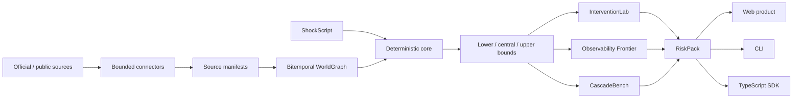

# CascadeLens

<p align="center">
  <strong>Trace how disruption becomes systemic risk.</strong><br />
  An evidence-graded, bitemporal world graph and executable shock compiler for global resilience analysis.
</p>

<p align="center">
  <a href="https://github.com/limingrui679-design/CascadeLens/actions/workflows/ci.yml"></a>
  <a href="https://github.com/limingrui679-design/CascadeLens/actions/workflows/codeql.yml"></a>
  <a href="https://github.com/limingrui679-design/CascadeLens/releases/latest"></a>
  <a href="LICENSE"></a>
  <a href="package.json"></a>
</p>

<p align="center">
  <a href="https://cascadelens.limingrui2.chatgpt.site"><strong>Open the live product</strong></a>
  ·
  <a href="#run-it-locally">Run locally</a>
  ·
  <a href="docs/README.md">Read the docs</a>
  ·
  <a href="docs/SELF_REVIEW_2026-08-13_v0.3.2.md">Inspect the evidence</a>
</p>


> [!IMPORTANT]
> **Current release: `v0.3.2`.** CascadeLens is a software-verified research release, not an empirically validated production decision system. Its 12 reference cases are all `scenario_only`: there are **0 historically scored cases, 0 external validations, and 0 claims of organizational adoption**.

## Why CascadeLens

Most shock-analysis demos collapse source data, assumptions, model inference, and realized outcomes into one confident-looking number. CascadeLens keeps those categories separate and carries the distinction through every result.

| Design principle | What the system enforces |
|---|---|
| Evidence stays graded | Observed, entity-reported, third-party-verified, text-extracted, and model-inferred relationships retain distinct provenance. |
| Time stays explicit | Event time and knowledge time are separate, so a frozen decision cutoff can block future evidence. |
| Uncertainty stays visible | Every cascade reports lower, central, and upper bounds rather than a single false-precision estimate. |
| Decisions stay auditable | A RiskPack carries inputs and outputs together; verification recomputes every derived result before accepting it. |
| Unsupported claims fail closed | Missing licenses, invalid temporal state, incompatible schemas, or insufficient evidence block stronger outputs. |

## Product tour

### Change assumptions and see the bounded result

The workbench recompiles a declared shock, compares intervention bundles with the do-nothing baseline, and keeps scenario outputs labelled as non-empirical.


### Inspect why each edge exists

The WorldGraph explorer exposes the source, evidence grade, validity interval, knowledge interval, and confidence attached to a relationship.


### Rebuild and verify every reference case

The catalog contains 9 context-grounded quasi-historical re-stresses and 3 synthetic stress tests. Public references provide context; the topology and numeric parameters remain explicit model assumptions, and every case remains `scenario_only`.


## Run it locally

Requirements: Node.js `>=22.13.0` and npm.

```bash
git clone https://github.com/limingrui679-design/CascadeLens.git
cd CascadeLens
npm ci
npm run generate:catalog
npm run generate:cases
npm run dev
```

Then open `http://localhost:3000`. To exercise the checked CLI and SDK paths without the UI:

```bash
npm run example:sdk
npm run cascadelens -- cases list
npm run cascadelens -- validate \
  content/cases/suez-route-restress/scenario.json \
  --graph content/cases/suez-route-restress/graph/snapshot.json
npm run cascadelens -- verify \
  content/cases/suez-route-restress/riskpack
```

See the complete [CLI guide](docs/CLI.md) and [TypeScript SDK guide](docs/SDK.md).

## How it works



The engine uses an explicit UTF-8 byte ordering rather than process locale: equal canonical graph snapshots, ShockScripts, and engine versions produce byte-stable JSON results across the tested locale matrix. Network acquisition runs outside the browser, while the public product reads reviewed artifacts.

## What ships

| Surface | Included in `v0.3.2` |
|---|---|
| WorldGraph | Evidence-graded, bitemporal nodes and edges with canonical content digests |
| ShockScript | Strict, versioned shock contract with graph-aware validation |
| Analysis | Daily multi-horizon propagation over time-varying graph visibility, with a bounded per-day convergence solver |
| Decision support | Activation-dated interventions and horizon-specific feasibility, Pareto frontiers, and recommendations |
| CascadeBench | Metric-, horizon-, outcome-window-, and availability-closed replay gates plus an honest `scenario_only` fallback |
| RiskPack | Inputs plus deterministically recomputed outputs, strict versioned metadata schemas, exact-byte assumption-source binding, parameter-level semantic checks, and an optional external expected digest |
| Data integration | 10 bounded connector contracts, including 3 lawfully redistributable frozen official-source runs with 3,802 normalized facts and zero inferred dependency edges |
| Reference library | 12 deterministic, cross-domain, scenario-only cases spanning five topology and four horizon profiles |
| Interfaces | Multi-route web product, CLI, TypeScript SDK, and public JSON Schemas |
| Assurance | Unit, integration, CLI, artifact, render, accessibility, security, performance, exact offline double-build, and detached-release checks |

### Reference-case coverage

| Context-grounded re-stresses | Synthetic stress tests |
|---|---|
| Suez route · Semiconductors · Medical PPE | Critical-minerals export controls |
| Food, fertilizer, and energy · Panama drought · Red Sea routing | Sanctions-list change |
| Baltimore port · Refining hurricane · Drug shortage | Food export compound |

Browse the [live case library](https://cascadelens.limingrui2.chatgpt.site/cases) or inspect the versioned [case catalog](content/cases/catalog.json).

## Repository map

```text
app/                    Public multi-route product
packages/
  core/                 WorldGraph, ShockScript, engines, interventions, benchmark, RiskPack
  connectors/           Official-source acquisition and normalization contracts
  cases/                Deterministic reference-case specifications and builder
  cli/                   Validation, execution, packaging, and verification commands
  sdk/                   Typed public exports and offline analysis helper
content/                 Reviewed manifests, scenario definitions, and generated artifacts
schemas/                 Versioned public JSON Schemas
examples/                Checked SDK usage
docs/                    Architecture, contracts, policies, and review evidence
scripts/                 Generation, validation, release, and reproducibility tooling
tests/                   Functional, boundary, web, security, and release coverage
worker/                  Cloudflare-compatible server entry
```

Use the focused guides for [package boundaries](packages/README.md), [content provenance](content/README.md), [examples](examples/README.md), and the complete [documentation index](docs/README.md).

## Documentation

| If you want to… | Start here |
|---|---|
| Evaluate what the project actually proves | [Acceptance matrix](docs/ACCEPTANCE_MATRIX.md) · [v0.3.2 audit remediation review](docs/SELF_REVIEW_2026-08-13_v0.3.2.md) |
| Understand the analytical design | [Architecture](docs/ARCHITECTURE.md) · [Product requirements](docs/PRODUCT_REQUIREMENTS.md) |
| Use the interfaces | [CLI](docs/CLI.md) · [SDK](docs/SDK.md) |
| Add an engine, connector, or case | [Extension guide](docs/EXTENDING.md) · [Connector contract](docs/connectors/CONNECTOR_CONTRACT.md) |
| Audit data rights and schema stability | [Data licenses](docs/DATA_LICENSES.md) · [Schema compatibility](docs/SCHEMA_COMPATIBILITY.md) |
| Inspect release reproducibility | [Release process](docs/RELEASE_PROCESS.md) · [Security policy](SECURITY.md) |

## Evidence boundaries

- Public-data examples are not client projects.
- The three frozen connector snapshots prove bounded acquisition, lineage, normalization, and conservative mapping at their recorded retrieval times; they are not historical outcomes or calibrated model inputs.
- A context-grounded re-stress is not a historically scored replay.
- Passing RiskPack verification proves that packaged derived outputs match deterministic recomputation from the packaged inputs. It does not prove predictive accuracy, publisher identity, or real-world impact; publisher identity requires an external digest or signature.
- Simulated impacts are not causal estimates, forecasts, or realized losses.
- Internal reproducibility is not external validation, deployment, adoption, or real-user impact.
- CascadeLens is not investment, legal, sanctions-compliance, clinical, emergency-response, or operational advice.

## Contributing

Contributions are welcome for connectors, engines, replay packs, product surfaces, documentation, and assurance. Every contribution must preserve source, time, license, evidence-grade, and scenario-status boundaries.

Read [CONTRIBUTING.md](CONTRIBUTING.md), follow the [Code of Conduct](CODE_OF_CONDUCT.md), use the issue templates, and run:

```bash
npm run ci
```

## Cite

If you use CascadeLens in research, cite the software release using the repository's [`CITATION.cff`](CITATION.cff). GitHub exposes the same metadata through **Cite this repository**.

## License

Licensed under the [Apache License 2.0](LICENSE).
