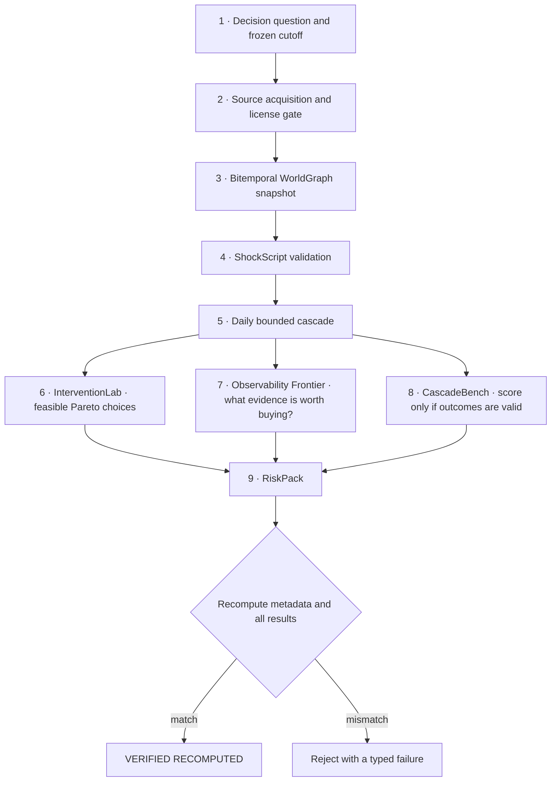

# CascadeLens

<p align="center">
  <strong>Trace how disruption becomes systemic risk—without hiding where the evidence ends.</strong><br />
  Compile sourced dependency graphs and versioned shock scenarios into bounded cascade estimates, feasible intervention frontiers, evidence-acquisition priorities, honest benchmark status, and recomputable RiskPacks.
</p>

<p align="center">
  <a href="https://github.com/limingrui679-design/CascadeLens/actions/workflows/ci.yml"></a>
  <a href="https://github.com/limingrui679-design/CascadeLens/actions/workflows/codeql.yml"></a>
  <a href="https://github.com/limingrui679-design/CascadeLens/releases/latest"></a>
  <a href="LICENSE"></a>
  <a href="package.json"></a>
</p>

<p align="center">
  <a href="https://cascadelens.limingrui2.chatgpt.site"><strong>Open the live product</strong></a>
  ·
  <a href="#quick-start">Run locally</a>
  ·
  <a href="#from-a-question-to-a-verifiable-riskpack">Follow the workflow</a>
  ·
  <a href="docs/README.md">Read the docs</a>
  ·
  <a href="docs/SELF_REVIEW_2026-08-13_v0.3.2.md">Inspect the evidence</a>
</p>


CascadeLens answers a concrete research question: **when evidence about global dependencies is incomplete and changes over time, how can an analyst test a disruption, compare possible responses, and preserve exactly which parts came from sources versus assumptions?** It is a local-first TypeScript and React platform for supply-chain, financial, infrastructure, policy, health, and critical-goods resilience analysis—not a single risk score or a graph visualization with hidden model logic.

A run begins with a source-linked WorldGraph snapshot, a frozen decision cutoff, and a versioned ShockScript that declares the disruption, targets, dates, propagation settings, analysis horizons, candidate interventions, costs, lead times, and constraints. CascadeLens then applies evidence-grade and bitemporal eligibility rules, simulates the visible graph day by day, and keeps model-inferred relationships outside the primary estimate instead of silently treating them as observed dependencies.

| Stage | What CascadeLens actually does |
|---|---|
| **Inputs** | Accepts a sealed WorldGraph, source manifests, explicit assumptions, a ShockScript, optional observation candidates, and—only when legitimately separated—post-event outcomes. |
| **Evidence and time gate** | Distinguishes official observation, entity reporting, third-party verification, text extraction, and model inference; checks both real-world validity and when each item became knowable at the frozen cutoff. |
| **Bounded cascade** | Recomputes daily propagation over acyclic or cyclic graphs and returns lower, central, and upper impacts, contributions, peaks, end states, excluded-edge counts, convergence, and warnings for every declared horizon. |
| **Decision analysis** | Tests `do_not_act` and intervention bundles against lead time, budget, capacity, and exclusivity; exposes feasible Pareto trade-offs and decision-reversal thresholds instead of hiding them behind one score. |
| **Evidence acquisition** | Estimates whether verifying a missing relationship could change the preferred action or reduce uncertainty enough to justify its acquisition cost, without claiming that the relationship is true. |
| **Benchmark discipline** | Scores a replay only when its metric, horizon, complete outcome window, source separation, and availability time pass the no-lookahead gate; otherwise returns `scenario_only`. |
| **Portable result** | Packages sources, graph, scenario, assumptions, model card, limitations, four machine-readable result sets, checksums, and rebuild instructions into a RiskPack whose metadata and analytical outputs are recomputed during verification. |

The repository therefore includes much more than the public dashboard: a deterministic analytical core, bitemporal evidence model, strict scenario language, ten bounded data-connector contracts, twelve executable reference cases, InterventionLab, Observability Frontier, CascadeBench, RiskPack protocol, CLI, typed SDK, multi-route web product, public JSON Schemas, adversarial tests, and a reproducible release pipeline.

<table>
  <tr>
    <td align="center"><strong>12</strong><br />executable reference cases</td>
    <td align="center"><strong>10</strong><br />bounded connector contracts</td>
    <td align="center"><strong>3,802</strong><br />normalized official-source facts</td>
    <td align="center"><strong>123 / 123</strong><br />core automated checks</td>
  </tr>
</table>

> [!IMPORTANT]
> **Current stable release: [`v0.3.2`](https://github.com/limingrui679-design/CascadeLens/releases/tag/v0.3.2).** All release numbers below refer to that immutable release. CascadeLens is software-verified research software, not an empirically validated production decision system. Its 12 reference cases are all `scenario_only`: there are **0 historically scored cases, 0 external validations, and 0 claims of organizational adoption**. The repository likewise supplies no verified real-user-impact evidence; “external validations” here includes external method and security validation.

<details>
<summary><strong>Table of contents</strong></summary>

- [Explore all 12 cases](#explore-all-12-cases)
- [Why CascadeLens](#why-cascadelens)
- [What this repository implements](#what-this-repository-implements)
- [From a question to a verifiable RiskPack](#from-a-question-to-a-verifiable-riskpack)
- [When the system stops or limits a claim](#when-the-system-stops-or-limits-a-claim)
- [Product tour](#product-tour)
- [Worked example: Suez route re-stress](#worked-example-suez-route-re-stress)
- [Quick start](#quick-start)
- [Evidence, time, and uncertainty model](#evidence-time-and-uncertainty-model)
- [RiskPack: portable verification, not a screenshot](#riskpack-portable-verification-not-a-screenshot)
- [Data integration](#data-integration)
- [Reference-case library](#reference-case-library)
- [Interfaces](#interfaces)
- [Verification and release engineering](#verification-and-release-engineering)
- [Repository map](#repository-map)
- [Documentation](#documentation)
- [Evidence boundaries](#evidence-boundaries)

</details>

## Explore all 12 cases

The complete launch library is visible here—not hidden behind the product tour. Select any title to inspect its scenario, graph, assumptions, results, model card, limitations, and rebuildable RiskPack in the repository. The same cases can also be run in the [live case library](https://cascadelens.limingrui2.chatgpt.site/cases).

<table>
  <tr>
    <td width="33%" valign="top">
      <strong><a href="content/cases/suez-route-restress/README.md">1 · Suez route</a></strong><br />
      <sub>Maritime trade · quasi-historical context · chain · 7/30/90 days</sub><br /><br />
      Tests which bounded intervention remains feasible when an assumed route interruption propagates toward production and market availability.
    </td>
    <td width="33%" valign="top">
      <strong><a href="content/cases/semiconductor-capacity-restress/README.md">2 · Semiconductors</a></strong><br />
      <sub>Advanced manufacturing · quasi-historical context · branch/merge · 7/30/90 days</sub><br /><br />
      Compares inventory, supplier diversification, and allocation under an assumed chip-capacity loss.
    </td>
    <td width="33%" valign="top">
      <strong><a href="content/cases/medical-ppe-demand-restress/README.md">3 · Medical PPE</a></strong><br />
      <sub>Public-health supply · quasi-historical context · branch/merge · 7/21/60 days</sub><br /><br />
      Evaluates feasible supply responses to a bounded protective-equipment demand surge and downstream access disruption.
    </td>
  </tr>
  <tr>
    <td width="33%" valign="top">
      <strong><a href="content/cases/ukraine-commodity-compound-restress/README.md">4 · Commodity compound</a></strong><br />
      <sub>Food and energy · quasi-historical context · cycle · 7/30/90 days</sub><br /><br />
      Tests buffers and substitution when several assumed commodity, logistics, and affordability channels move together.
    </td>
    <td width="33%" valign="top">
      <strong><a href="content/cases/panama-drought-restress/README.md">5 · Panama drought</a></strong><br />
      <sub>Climate and logistics · quasi-historical context · dynamic activation · 7/30/90 days</sub><br /><br />
      Examines when route diversification becomes preferable to inventory buffering under a canal-capacity constraint.
    </td>
    <td width="33%" valign="top">
      <strong><a href="content/cases/red-sea-rerouting-restress/README.md">6 · Red Sea routing</a></strong><br />
      <sub>Geopolitics and shipping · quasi-historical context · dynamic expiry · 7/30/90 days</sub><br /><br />
      Compares continuity interventions while an assumed route-avoidance edge changes across the simulated horizon.
    </td>
  </tr>
  <tr>
    <td width="33%" valign="top">
      <strong><a href="content/cases/baltimore-port-restress/README.md">7 · Baltimore port</a></strong><br />
      <sub>Port infrastructure · quasi-historical context · chain · 7/30/90 days</sub><br /><br />
      Compares alternate-port and inventory-buffer choices under an assumed sudden loss of port access.
    </td>
    <td width="33%" valign="top">
      <strong><a href="content/cases/refining-hurricane-restress/README.md">8 · Refining hurricane</a></strong><br />
      <sub>Energy infrastructure · quasi-historical context · chain · 7/30/90 days</sub><br /><br />
      Tests reserve, rerouting, and demand-management bundles under bounded refining-capacity disruption.
    </td>
    <td width="33%" valign="top">
      <strong><a href="content/cases/critical-minerals-export-stress/README.md">9 · Critical minerals</a></strong><br />
      <sub>Minerals and technology · synthetic stress · chain · 14/45/120 days</sub><br /><br />
      Values diversification and additional evidence under an assumed concentrated critical-mineral dependency.
    </td>
  </tr>
  <tr>
    <td width="33%" valign="top">
      <strong><a href="content/cases/ofac-list-change-stress/README.md">10 · Sanctions change</a></strong><br />
      <sub>Financial and compliance operations · synthetic stress · chain · 3/14/60 days</sub><br /><br />
      Tests operational safeguards while preserving a fail-closed compliance boundary after an assumed list change.
    </td>
    <td width="33%" valign="top">
      <strong><a href="content/cases/drug-shortage-restress/README.md">11 · Drug shortage</a></strong><br />
      <sub>Medicines · quasi-historical context · chain · 7/21/60 days</sub><br /><br />
      Evaluates which bounded supply intervention remains feasible when an assumed medicine constraint reaches care access.
    </td>
    <td width="33%" valign="top">
      <strong><a href="content/cases/food-export-compound-stress/README.md">12 · Food export compound</a></strong><br />
      <sub>Agriculture and trade · synthetic stress · chain · 7/30/90 days</sub><br /><br />
      Compares reserve and diversification choices under simultaneous assumed production loss and export restriction.
    </td>
  </tr>
</table>

> [!NOTE]
> “Quasi-historical context” means that an event or official page frames the question; it does not supply the assumed dependency graph or validate the calculated impacts. All 12 cases remain `scenario_only` and must not be described as forecasts, client projects, or historically scored evidence.

## Why CascadeLens

Systemic-risk analysis becomes unreliable when a polished output silently mixes observed facts, reported relationships, extracted text, model assumptions, and outcomes that were only known after the decision. A graph can look complete while its most important edges are conjectural; a historical replay can look accurate because it leaked future information; and an intervention can look optimal because its cost, lead time, or missing dependencies were hidden.

CascadeLens was built around the opposite discipline: preserve those distinctions all the way from ingestion to the final artifact.

| Common failure | CascadeLens control |
|---|---|
| A source page is treated as proof of a dependency | Sources, nodes, edges, and assumptions remain separate objects with evidence grades and hashes. |
| Information available after the decision enters a replay | Valid time and knowledge time are stored separately; a frozen cutoff blocks later evidence. |
| Missing relationships disappear from the result | The engine reports lower, central, and upper graph bounds and counts excluded edges. |
| Model-inferred edges become a confident point estimate | Inferred and text-extracted edges are barred from lower and central estimates and may enter only the explicit upper envelope. |
| A recommendation ignores feasibility | Intervention bundles retain cost, lead time, capacity, exclusivity, and horizon-specific feasibility. |
| More data are always assumed to be valuable | The Observability Frontier compares decision value and uncertainty reduction with acquisition cost. |
| A scenario is presented as a validated forecast | CascadeBench returns `scenario_only` unless separated, temporally valid outcomes support scoring. |
| An exported report trusts its stored answers | RiskPack verification reconstructs metadata and recomputes every derived analytical result. |

The intended output is therefore not always an action. A valid result can be a bounded intervention set, `evidence_required`, `do_not_act`, `scenario_only`, or a hard validation failure.

## What this repository implements

The repository implements eight connected systems rather than a single model or visualization.

| System | What was implemented | Inspectable output |
|---|---|---|
| **WorldGraph** | Typed, directed nodes and dependencies with evidence grade, confidence, license lineage, valid-time intervals, knowledge-time intervals, eligibility rules, canonical serialization, and content-addressed snapshots | `graph/snapshot.json` plus a stable snapshot digest |
| **ShockScript** | A strict YAML/JSON contract for targets, shock operations, dates, propagation parameters, multiple horizons, intervention candidates, objectives, and constraints | A validated `scenario.json` with field-level error paths |
| **Cascade engine** | Daily propagation over acyclic or cyclic graphs, bitemporal visibility checks on every simulated day, fixed-point convergence controls, simultaneous shocks, and lower/central/upper missing-graph bounds | `results/cascade-bounds.json` |
| **InterventionLab** | Lead-time-aware activation, budgets, capacity and mutual-exclusion constraints, a `do_not_act` baseline, horizon-specific feasibility, Pareto frontiers, robust worst-case comparison, and decision-reversal thresholds | `results/interventions.json` |
| **Observability Frontier** | Value-of-information analysis for missing relationships using decision-change probability, worst-case reduction, uncertainty reduction, evidence-acquisition cost, and an explicit non-promotion rule | `results/observability.json` |
| **CascadeBench** | A no-lookahead scoring gate that binds metric, horizon, complete outcome window, outcome-source availability, and frozen decision cutoff before allowing historical scoring | `results/benchmark.json` or an honest `scenario_only` status |
| **RiskPack protocol** | A portable package containing inputs, provenance, assumptions, model card, limitations, results, checksums, rebuild instructions, strict metadata schemas, and semantic cross-bindings | A directory or ZIP that can be independently recomputed by the verifier |
| **Product and release layer** | Ten connector contracts, CLI, TypeScript SDK, nine web route categories, accessibility/security gates, local fonts, offline deterministic builds, SBOM generation, no-Git release verification, and immutable GitHub publication | Public product, versioned schemas, release assets, CI receipts, and `/build-info.json` |

These systems share one evidence contract. The web interface renders canonical core results; it does not implement a separate analytical truth. The CLI, SDK, generated cases, and web product all consume the same schemas and deterministic functions.

## From a question to a verifiable RiskPack



| Stage | What happens | Evidence retained |
|---|---|---|
| **1. Frame the decision** | Declare the disruption, target, time horizon, decision cutoff, candidate interventions, costs, and constraints before running the engine. | Versioned ShockScript fields and model parameters |
| **2. Acquire evidence** | A connector enforces allowed hosts, request identification, rate and size limits, response hashing, license mode, retries, and atomic checkpointing. | Raw payload where lawful, query, checkpoint, source manifest, timestamps, and SHA-256 |
| **3. Build the graph** | Facts are normalized into stable row-order-independent IDs. Dependency edges must be separately supported or explicitly marked as assumptions; generic mapping never invents them. | Canonical WorldGraph snapshot and lineage |
| **4. Freeze time** | Each visible object must satisfy both its real-world validity interval and the time at which it was observable to the system. | Decision cutoff, valid time, observed time, and excluded-object record |
| **5. Run bounded propagation** | Each horizon is simulated day by day. Cycles use bounded fixed-point iteration; evidence eligibility and time visibility are checked on every day. | Lower, central, and upper impacts, convergence state, contributions, warnings, and excluded-edge counts |
| **6. Compare interventions** | Bundles activate only after their declared lead time. The engine tests feasibility, retains the no-action baseline, and exposes cost/risk trade-offs rather than hiding them in one score. | Pareto frontier, activation schedule, feasible set, recommendation status, and reversal thresholds |
| **7. Price missing evidence** | Candidate observations are tested for whether they could change the decision or reduce the worst-case result enough to justify acquisition. | Value-of-information ranking and `worth_acquiring` / `not_cost_effective` status |
| **8. Attempt validation** | Outcomes must be separated from inputs, cover the full declared window, and become available only after that window. Otherwise scoring is refused. | Scoring status, leakage issues, sample size, metrics, and limitations |
| **9. Package and verify** | All inputs and results are sealed into a RiskPack. Verification validates strict schemas, reconstructs metadata, checks semantic bindings, and reruns all analytical outputs. | Relative checksums, canonical pack digest, rebuild instructions, and verification result |

## When the system stops or limits a claim

CascadeLens treats refusal as part of the product rather than as an error to hide.

| Condition | System response | What is not allowed |
|---|---|---|
| Source license is missing or incompatible | Acquisition or redistribution is blocked | Silently bundling the payload |
| A relationship is text-extracted or model-inferred | It is excluded from lower and central estimates and retained only in the upper envelope | Promoting it to an observed dependency |
| Temporal visibility fails at the cutoff | The node, edge, or outcome is excluded and the failure is surfaced | Using later knowledge in an earlier decision |
| Graph or scenario identifiers, dates, bounds, or versions conflict | Validation fails with a concrete field path | Guessing or coercing a compatible value |
| An intervention violates budget, capacity, exclusivity, or lead time | It is marked infeasible or pending | Recommending an impossible bundle |
| Evidence could change the recommendation | Status remains `evidence_required` | Presenting the action as decision-ready |
| Comparable post-event outcomes are absent | Benchmark status remains `scenario_only` | Reporting historical accuracy, calibration, or regret |
| RiskPack inputs, metadata, or recomputed results differ | Verification rejects the package | Trusting refreshed internal checksums alone |

## Product tour

### Change assumptions and see the bounded result

The workbench recompiles a declared shock, shows lower/central/upper results across multiple horizons, compares intervention bundles with the do-nothing baseline, exposes lead times and constraints, and keeps scenario outputs labelled as non-empirical.


### Inspect why each edge exists

The WorldGraph explorer exposes the source, evidence grade, validity interval, knowledge interval, confidence, and analytical eligibility attached to each relationship. Observed and inferred relationships remain visually and computationally distinct.


### Rebuild and verify every reference case

The case library contains nine context-grounded quasi-historical re-stresses and three synthetic stress tests. Public references provide context; topology and numerical parameters remain explicit assumptions. Every case includes a complete RiskPack and remains `scenario_only`.


## Worked example: Suez route re-stress

The [Suez route case](content/cases/suez-route-restress/README.md) demonstrates why CascadeLens separates context from model structure.

**Decision question:** Which bounded intervention remains feasible if the Suez route becomes unavailable for a short planning horizon?

The Suez Canal Authority page is retained as a context citation. It does **not** supply the five-node topology, four dependency edges, shock magnitude, transmission weights, intervention effects, or outcome labels. Those values are recorded as model assumptions and bound to exact parameter paths in the RiskPack.

```text
Suez route  →  maritime inputs  →  assembly  →  distribution  →  market
 direct shock       assumed edge      assumed edge    assumed edge   assumed edge
```

| Output | Recomputed result | Interpretation |
|---|---:|---|
| 90-day lower impact | `0.064444` | Uses only official-observed and entity-reported eligible relationships. |
| 90-day central impact | `0.064444` | Adds third-party-verified relationships; the four model-inferred edges still remain excluded. |
| 90-day upper impact | `0.163606` | Includes the explicit inferred dependency envelope, making missing-graph risk visible. |
| Intervention frontier | 4 feasible points | Retains `do_not_act`, buffer, reroute, and combined bundles with costs and activation dates. |
| Recommendation status | `evidence_required` | The engine exposes feasible trade-offs but does not call an assumption-driven result operationally validated. |
| Observation candidate | `not_cost_effective` | Under the declared values, its expected information value is `0` against acquisition cost `3`. |
| Benchmark | `scenario_only`, sample size `0` | No comparable separated outcome is available, so accuracy is not manufactured. |

The case can be rebuilt and verified from source:

```bash
npm run cascadelens -- cases build suez-route-restress
npm run cascadelens -- verify content/cases/suez-route-restress/riskpack
```

This example is deliberately modest. It demonstrates software behavior, evidence boundaries, and decision logic—not a reconstructed 2021 trade network or a validated forecast of losses.

## Quick start

Requirements: Node.js `>=22.13.0` and npm.

```bash
git clone https://github.com/limingrui679-design/CascadeLens.git
cd CascadeLens
npm ci
npm run generate:catalog
npm run generate:cases
npm run dev
```

Open `http://localhost:3000`.

### Choose an entry path

| Goal | Command or link | Result |
|---|---|---|
| Explore without installing | [Open the live product](https://cascadelens.limingrui2.chatgpt.site) | Read-only reviewed cases, workbench, graph, benchmark, data, method, and documentation routes |
| List the reference cases | `npm run cascadelens -- cases list` | Case identity, classification, status, and rebuild path |
| Validate a scenario | `npm run cascadelens -- validate <scenario> --graph <snapshot>` | Typed success or field-level validation failures |
| Run the local engine | `npm run cascadelens -- run <scenario> --graph <snapshot> --out <result.json>` | Bounded scenario output labelled as non-empirical |
| Build a case | `npm run cascadelens -- cases build <slug>` | Deterministically regenerated case artifacts and RiskPack |
| Verify one or all packs | `npm run cascadelens -- verify <riskpack>` or `npm run cascadelens -- cases verify all` | `VERIFIED RECOMPUTED` or a typed rejection |
| Exercise the SDK | `npm run example:sdk` | Typed local analysis of the Suez reference case |
| Inspect connector contracts | `npm run cascadelens -- connectors list` | Sources, hosts, license modes, limits, and evidence boundaries |

A complete CLI example:

```bash
npm run cascadelens -- validate \
  content/cases/suez-route-restress/scenario.json \
  --graph content/cases/suez-route-restress/graph/snapshot.json

npm run cascadelens -- run \
  content/cases/suez-route-restress/scenario.json \
  --graph content/cases/suez-route-restress/graph/snapshot.json \
  --out local-results.json

npm run cascadelens -- verify \
  content/cases/suez-route-restress/riskpack
```

See the complete [CLI guide](docs/CLI.md) and [TypeScript SDK guide](docs/SDK.md).

## Evidence, time, and uncertainty model

### Five evidence grades

The evidence grade controls which analytical envelope may use a relationship. Confidence does not override this rule.

| Evidence grade | Lower | Central | Upper | Typical interpretation |
|---|:---:|:---:|:---:|---|
| `OFFICIAL_OBSERVED` | ✓ | ✓ | ✓ | Direct official observation within its stated scope |
| `ENTITY_REPORTED` | ✓ | ✓ | ✓ | A statement or record supplied by the entity itself |
| `THIRD_PARTY_VERIFIED` | — | ✓ | ✓ | A relationship supported by an independent third-party source |
| `TEXT_EXTRACTED` | — | — | ✓ | A candidate relation extracted from text but not promoted to primary evidence |
| `MODEL_INFERRED` | — | — | ✓ | An explicit assumption used only to expose the missing-graph envelope |

### Two clocks

Every evidence-bearing object distinguishes:

- **valid time** — when the relationship or value applied in the world;
- **knowledge time** — when the source made that information available to the system.

A replay can use an object only if it was valid for the simulated day **and** observable by the frozen decision cutoff. Outcome sources are kept in a separate partition, must cover the complete declared result window, and must not become available before that window closes.

### Three bounds, not one false-precision number

- **Lower** uses official-observed and entity-reported eligible relationships.
- **Central** adds third-party-verified relationships but still excludes text extraction and model inference.
- **Upper** includes every explicitly declared relationship, including extracted and inferred candidates, using the scenario's upper parameter envelope.

Each result reports time-weighted impact, peak envelope, end impact, convergence, per-node contributions, excluded evidence counts, and warnings. Graph visibility is reevaluated on every simulated day, so activation and expiry dates can change the propagation path inside one horizon.

## RiskPack: portable verification, not a screenshot

A RiskPack keeps the evidence chain and the computed claim together:

```text
riskpack/
├── manifest.json
├── sources/manifest.json
├── graph/snapshot.json
├── scenario.json
├── assumptions.json
├── model-card.json
├── limitations.json
├── inputs/
│   ├── benchmark-outcomes.json
│   ├── observation-candidates.json
│   └── observability-config.json
├── results/
│   ├── cascade-bounds.json
│   ├── interventions.json
│   ├── observability.json
│   └── benchmark.json
├── checksums.sha256
└── REBUILD.txt
```

Verification does more than compare stored hashes:

1. Reject unsafe paths, undeclared files, incompatible versions, malformed identifiers, and invalid relative checksums.
2. Validate the WorldGraph, ShockScript, RiskPack manifest, assumption register, model card, and limitations against strict runtime contracts and published JSON Schemas.
3. Bind the assumption register's exact bytes, byte length, and SHA-256 to its unique source record.
4. Require a one-to-one semantic match between each assumption and its actual `parameterPath`, `targetId`, value, bounds, and unit in the scenario, inferred graph edge, or observation candidate.
5. Reconstruct model-card status and mandatory limitations from the packaged scenario and benchmark rather than trusting self-declared metadata.
6. Recompute cascade bounds, interventions, observability, and benchmark output from the packaged inputs and compare canonical bytes.
7. Optionally compare the whole-pack digest with a separately retained expected digest.

This design rejects both altered outputs and self-consistently rehashed metadata contradictions. It proves internal consistency with the declared engine and inputs. It does not prove that the assumptions are realistic, that the publisher is authentic without an external trust channel, or that the model predicts the real world.

## Data integration

The connector layer covers UN Comtrade, OECD ICIO, SEC EDGAR, GLEIF, FAOSTAT, openFDA Drug Shortages, OFAC SLS, World Bank WITS, UNCTAD LSCI, and IMF PortWatch.

Each contract records official documentation, allowed hosts, authentication mode, minimum request interval, response limit, license and redistribution mode, operational notes, and a domain-specific evidence boundary. Acquisition runs outside the browser and performs bounded fetch, exact-byte hashing, atomic checkpointing, manifest verification, normalization, stable-ID ordering, and conservative WorldGraph mapping.

| Shipping state | What is included | What it proves |
|---|---|---|
| **10 connector contracts** | Eight remote and two import-only adapters; six `download_on_run`, three redistributable, and one user-provided license mode | Interface, safety, normalization, and lineage behavior on checked fixtures |
| **3 frozen official-source runs** | FAOSTAT, GLEIF, and openFDA payloads with queries, checkpoints, manifests, normalized records, hashes, attribution, and graph snapshots | Dated acquisition and reproducible normalization of lawful public data |
| **3,802 normalized facts** | 3,800 FAOSTAT records plus one GLEIF and one openFDA record | Fact-level pipeline behavior at the recorded retrieval times |
| **0 dependency edges from those runs** | Generic mapping creates metric nodes but refuses to invent causal or operational dependencies | Conservative mapping behavior—not absence of real-world relationships |
| **7 remaining connectors without frozen public runs** | Contracts and fictional multi-row fixtures | Checked adapter behavior, not populated production pipelines |

Read [Data licenses](docs/DATA_LICENSES.md), the [connector contract](docs/connectors/CONNECTOR_CONTRACT.md), the [data catalog](docs/connectors/DATA_CATALOG.md), and the [frozen snapshot ledger](content/snapshots/README.md) before acquiring or redistributing data.

## Reference-case library

All 12 cases are deterministic structural demonstrations. Nine use real events or official pages only as context for quasi-historical re-stress; three are synthetic stress fixtures. None has separated comparable outcomes, so all remain `scenario_only`.

| Case | Classification | Structural profile | Horizons |
|---|---|---|---|
| [Suez route](content/cases/suez-route-restress/README.md) | Quasi-historical | Chain | 7 / 30 / 90 days |
| [Semiconductor capacity](content/cases/semiconductor-capacity-restress/README.md) | Quasi-historical | Branch / merge | 7 / 30 / 90 days |
| [Medical PPE demand](content/cases/medical-ppe-demand-restress/README.md) | Quasi-historical | Branch / merge | 7 / 21 / 60 days |
| [Food, fertilizer, and energy](content/cases/ukraine-commodity-compound-restress/README.md) | Quasi-historical | Cycle | 7 / 30 / 90 days |
| [Panama drought](content/cases/panama-drought-restress/README.md) | Quasi-historical | Dynamic activation | 7 / 30 / 90 days |
| [Red Sea rerouting](content/cases/red-sea-rerouting-restress/README.md) | Quasi-historical | Dynamic expiry | 7 / 30 / 90 days |
| [Baltimore port](content/cases/baltimore-port-restress/README.md) | Quasi-historical | Chain | 7 / 30 / 90 days |
| [Refining hurricane](content/cases/refining-hurricane-restress/README.md) | Quasi-historical | Chain | 7 / 30 / 90 days |
| [Critical-minerals export controls](content/cases/critical-minerals-export-stress/README.md) | Synthetic stress | Chain | 14 / 45 / 120 days |
| [Sanctions-list change](content/cases/ofac-list-change-stress/README.md) | Synthetic stress | Chain | 3 / 14 / 60 days |
| [Drug shortage](content/cases/drug-shortage-restress/README.md) | Quasi-historical | Chain | 7 / 21 / 60 days |
| [Food export compound](content/cases/food-export-compound-stress/README.md) | Synthetic stress | Chain | 7 / 30 / 90 days |

The collection covers chain, branch/merge, cycle, dynamic activation, and dynamic expiry topologies across four horizon profiles. That diversity strengthens structural regression coverage; it does not establish empirical accuracy.

Browse the [live case library](https://cascadelens.limingrui2.chatgpt.site/cases), the versioned [case catalog](content/cases/catalog.json), or the [case-generation design](content/cases/README.md).

## Interfaces

| Surface | Purpose | Source of truth |
|---|---|---|
| **Overview** | Explain evidence grades, public scope, and the end-to-end product | Reviewed content catalog and generated cases |
| **WorldGraph explorer** | Inspect observed and inferred nodes/edges, time state, provenance, and eligibility | Canonical graph snapshot |
| **Scenario workbench** | Change bounded assumptions, recompile, compare horizons and interventions, share state, and export | Deterministic core analysis |
| **Case library** | Explore all 12 reference pipelines and download RiskPacks | Generated case catalog and archive catalog |
| **Benchmark** | Show scoring status, no-lookahead requirements, and honest zero historical coverage | CascadeBench results |
| **Data catalog** | Expose connector contracts, license boundaries, and frozen snapshot receipts | Connector and snapshot catalogs |
| **Method and docs** | Explain modeling choices, schemas, commands, and limitations | Versioned repository documentation |
| **CLI** | Validate, run, pack, verify, rebuild cases, and acquire bounded connector data | Core and connector packages |
| **TypeScript SDK** | Embed strict types and deterministic analysis in local code | `packages/sdk/src/index.ts` |

The public site is read-only and consumes reviewed bundled artifacts. Local CLI and SDK paths support generation and analysis without requiring a hosted database.

## Verification and release engineering

The immutable `v0.3.2` release records the following checked results:

<table>
  <tr>
    <td align="center"><strong>123 / 123</strong><br />unit, integration, CLI, connector, artifact, and invariant checks</td>
    <td align="center"><strong>12 / 12</strong><br />RiskPacks rebuilt and verified</td>
    <td align="center"><strong>10 / 10</strong><br />connector contracts validated</td>
    <td align="center"><strong>3 / 3</strong><br />official snapshots rechecked</td>
  </tr>
  <tr>
    <td align="center"><strong>5 / 5</strong><br />documentation checks</td>
    <td align="center"><strong>8 / 8</strong><br />render and security-control checks</td>
    <td align="center"><strong>2 / 2</strong><br />automated accessibility checks</td>
    <td align="center"><strong>0</strong><br />known npm vulnerabilities</td>
  </tr>
</table>

Run the complete local gate:

```bash
npm run ci
```

The gate includes linting, strict TypeScript checks, SDK and CLI examples, content validation, local-link validation, production build, rendered-route checks, automated accessibility checks, repository security scanning, dependency audit, and a 20,000-node/19,999-edge engineering smoke profile.

Release verification adds stronger controls:

- source ZIP and tarball, CycloneDX SBOM, relative checksums, release manifest, and detached verification report;
- fresh installation and complete CI from an extracted archive without `.git`;
- deterministic regeneration of catalogs, cases, RiskPacks, and SBOM;
- repository-local fonts and a process-level guard that blocks non-loopback network access during production builds;
- deletion of `dist`, `.next`, and `.vinext` before each build, plus a stale-output sentinel that the real build must remove;
- two exact offline production builds with the same complete `dist` tree digest;
- Ubuntu and macOS reproducibility jobs, full CI, CodeQL, and an immutable GitHub Release.

The exact clean-tag production build digest is `f4a2b756ae45a0d84a5f865da2142460f8c02f3ba009aef7b903e3f1f2aa4539`. The source ZIP SHA-256 is `ec39eddf304167e0a984e7ac09e85a70981bce64f3039f4d4bc34cbdc6cab5a4`.

The checked synthetic performance profile completed in 5,200–5,625 ms with 177,209,344–178,487,296-byte RSS deltas. Client assets totaled 959,614 bytes, with the largest individual asset at 190,101 bytes. These are bounded engineering gates on the recorded environment, not a production SLA or a real-world model benchmark.

Use the [acceptance matrix](docs/ACCEPTANCE_MATRIX.md), [v0.3.2 audit-remediation review](docs/SELF_REVIEW_2026-08-13_v0.3.2.md), and [release process](docs/RELEASE_PROCESS.md) to trace every completion claim to code, tests, or detached release evidence.

## Repository map

```text
cascadelens/
├── app/                         React product routes and UI components
├── packages/
│   ├── core/                    WorldGraph, ShockScript, engines, decisions, benchmark, RiskPack
│   ├── connectors/              Bounded acquisition, normalization, lineage, and graph mapping
│   ├── cases/                   Deterministic case specifications and builder
│   ├── cli/                     Validate, run, pack, verify, cases, and connectors commands
│   └── sdk/                     Typed public exports and local analysis helper
├── content/
│   ├── catalog/                 Reviewed connector catalog
│   ├── snapshots/               Three frozen official-source runs and receipts
│   └── cases/                   Twelve scenarios, graphs, results, model cards, and RiskPacks
├── schemas/                     Six versioned public JSON Schemas
├── examples/                    Checked TypeScript SDK example
├── docs/                        Architecture, contracts, methods, policies, and review evidence
├── scripts/                     Generation, validation, security, performance, and release tooling
├── tests/                       Functional, adversarial, web, accessibility, security, and release tests
├── worker/                      Cloudflare-compatible server entry and strict response policy
└── .github/                     CI, CodeQL, reproducible-build matrix, and repository governance
```

The package boundaries are intentional: the deterministic core does not depend on React; connectors do not run in the browser; the UI consumes reviewed outputs; and release verification can run from a source archive without Git metadata.

Use the focused guides for [package boundaries](packages/README.md), [content provenance](content/README.md), [examples](examples/README.md), and the complete [documentation index](docs/README.md).

## Documentation

| If you want to… | Start here |
|---|---|
| Understand what the project proves | [Acceptance matrix](docs/ACCEPTANCE_MATRIX.md) · [v0.3.2 audit-remediation review](docs/SELF_REVIEW_2026-08-13_v0.3.2.md) |
| Understand the analytical design | [Architecture](docs/ARCHITECTURE.md) · [Product requirements](docs/PRODUCT_REQUIREMENTS.md) |
| Use the interfaces | [CLI](docs/CLI.md) · [SDK](docs/SDK.md) |
| Add an engine, connector, or case | [Extension guide](docs/EXTENDING.md) · [Connector contract](docs/connectors/CONNECTOR_CONTRACT.md) |
| Audit data rights and schema stability | [Data licenses](docs/DATA_LICENSES.md) · [Schema compatibility](docs/SCHEMA_COMPATIBILITY.md) |
| Reproduce release evidence | [Release process](docs/RELEASE_PROCESS.md) · [Performance](docs/PERFORMANCE.md) · [Security policy](SECURITY.md) |
| Plan legitimate external validation | [External validation protocol](docs/EXTERNAL_VALIDATION_PROTOCOL.md) |
| Navigate all documentation | [Documentation hub](docs/README.md) |

## Evidence boundaries

| Demonstrated by this repository | Not demonstrated |
|---|---|
| Deterministic scenario compilation and bounded propagation on checked fixtures | Empirical predictive accuracy or calibrated real-world dependency weights |
| Bitemporal no-lookahead enforcement | Completeness or truth of any public source |
| License-aware acquisition and fact-level lineage for three frozen public runs | Ten populated production data pipelines or a complete global dependency graph |
| Feasibility, Pareto, and value-of-information calculations under declared assumptions | An operational recommendation, causal effect, or realized loss reduction |
| Tamper-evident semantic and derived-output recomputation inside RiskPacks | Publisher identity without an external trust channel or digital signature |
| Reproducible release engineering across the tested Ubuntu/macOS matrix | Production deployment, availability SLA, institutional adoption, or real-user impact |

Additional boundaries:

- Public-data examples are not client projects.
- A context-grounded re-stress is not a historically scored replay.
- Simulated impacts are not forecasts, causal estimates, or realized losses.
- Passing tests and RiskPack verification does not convert assumptions into facts.
- Internal reproducibility is not independent method review, security certification, external validation, adoption, or impact.
- CascadeLens is not investment, legal, sanctions-compliance, clinical, emergency-response, or operational advice.

## Contributing

Contributions are welcome for connectors, engines, replay packs, product surfaces, documentation, and assurance. Every contribution must preserve source, time, license, evidence-grade, and scenario-status boundaries.

Read [CONTRIBUTING.md](CONTRIBUTING.md), follow the [Code of Conduct](CODE_OF_CONDUCT.md), use the issue templates, and run:

```bash
npm run ci
```

Security issues should follow the private-reporting guidance in [SECURITY.md](SECURITY.md).

## Cite

If you use CascadeLens in research, cite the exact reviewed software release using [`CITATION.cff`](CITATION.cff). GitHub exposes the same metadata through **Cite this repository**.

## License

Licensed under the [Apache License 2.0](LICENSE). © 2026 Mingrui Li.
