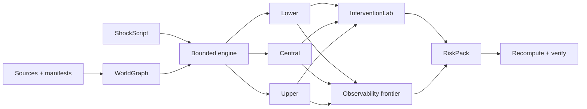
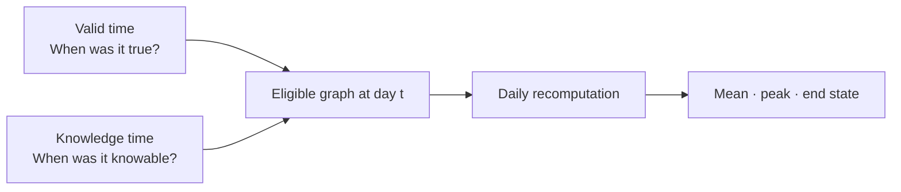
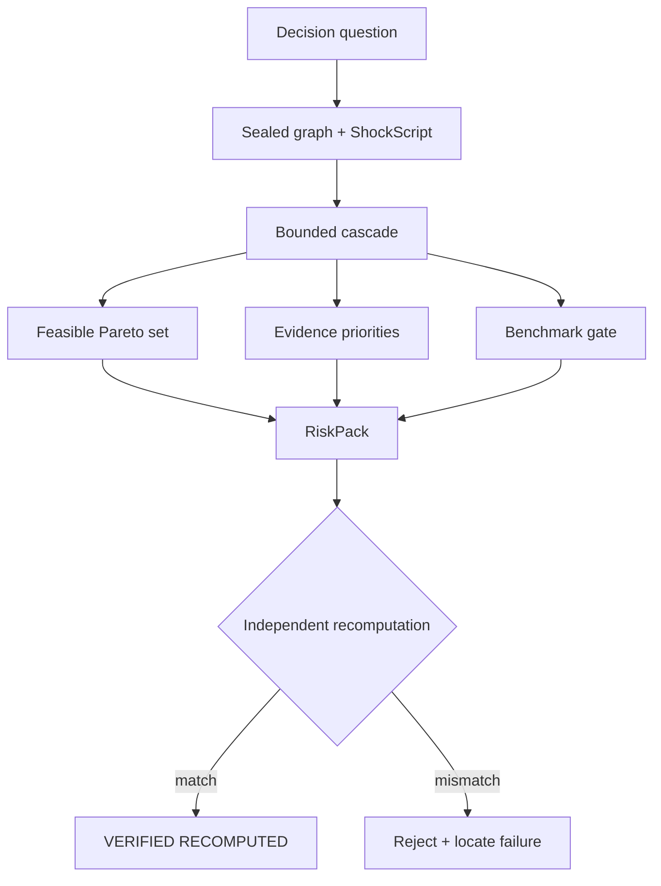
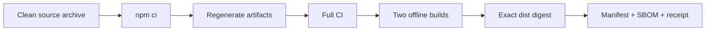

# CascadeLens

<p align="center">
  <strong>Trace how disruption becomes systemic risk—without hiding where the evidence ends.</strong><br />
  Evidence-graded graphs · executable shocks · bounded decisions · recomputable proof
</p>

<p align="center">
  <a href="https://github.com/limingrui679-design/CascadeLens/actions/workflows/ci.yml"></a>
  <a href="https://github.com/limingrui679-design/CascadeLens/actions/workflows/codeql.yml"></a>
  <a href="https://github.com/limingrui679-design/CascadeLens/releases/latest"></a>
  <a href="LICENSE"></a>
  <a href="package.json"></a>
</p>

<p align="center">
  <a href="https://cascadelens.limingrui2.chatgpt.site"><strong>Open the live product</strong></a>
  · <a href="#quick-start">Run locally</a>
  · <a href="#explore-all-12-cases">Explore 12 cases</a>
  · <a href="docs/README.md">Read the docs</a>
  · <a href="docs/SELF_REVIEW_2026-08-13_v0.3.2.md">Inspect the evidence</a>
</p>


CascadeLens turns a sourced **WorldGraph snapshot**, a **frozen decision cutoff**, and a versioned **ShockScript** into an auditable decision artifact.

Each run reports **lower, central, and upper impacts**, exposes **feasible Pareto trade-offs**, returns `scenario_only` when outcomes are insufficient, and writes a **RiskPack whose metadata and analytical outputs are recomputed** during verification.

<table>
  <tr>
    <td align="center"><strong>12</strong><br /><sub>executable cases</sub></td>
    <td align="center"><strong>10</strong><br /><sub>connector contracts</sub></td>
    <td align="center"><strong>3,802</strong><br /><sub>normalized official-source facts</sub></td>
    <td align="center"><strong>123 / 123</strong><br /><sub>core automated checks</sub></td>
  </tr>
</table>

> [!IMPORTANT]
> Stable release: **[`v0.3.2`](https://github.com/limingrui679-design/CascadeLens/releases/tag/v0.3.2)**. It contains **0 historically scored cases**, **0 external validations**, and **0 claims of organizational adoption**. The 12 launch cases are deterministic, `scenario_only` research demonstrations—not forecasts or client projects.

## Explore all 12 cases


<table>
  <tr>
    <td width="33%" valign="top"><strong><a href="content/cases/suez-route-restress/README.md">01 · Suez route</a></strong><br /><sub>Maritime trade · chain · 7/30/90d</sub></td>
    <td width="33%" valign="top"><strong><a href="content/cases/semiconductor-capacity-restress/README.md">02 · Semiconductors</a></strong><br /><sub>Manufacturing · branch/merge · 7/30/90d</sub></td>
    <td width="33%" valign="top"><strong><a href="content/cases/medical-ppe-demand-restress/README.md">03 · Medical PPE</a></strong><br /><sub>Public health · branch/merge · 7/21/60d</sub></td>
  </tr>
  <tr>
    <td valign="top"><strong><a href="content/cases/ukraine-commodity-compound-restress/README.md">04 · Commodity compound</a></strong><br /><sub>Food + energy · cycle · 7/30/90d</sub></td>
    <td valign="top"><strong><a href="content/cases/panama-drought-restress/README.md">05 · Panama drought</a></strong><br /><sub>Climate + logistics · activation · 7/30/90d</sub></td>
    <td valign="top"><strong><a href="content/cases/red-sea-rerouting-restress/README.md">06 · Red Sea routing</a></strong><br /><sub>Shipping · expiry · 7/30/90d</sub></td>
  </tr>
  <tr>
    <td valign="top"><strong><a href="content/cases/baltimore-port-restress/README.md">07 · Baltimore port</a></strong><br /><sub>Infrastructure · chain · 7/30/90d</sub></td>
    <td valign="top"><strong><a href="content/cases/refining-hurricane-restress/README.md">08 · Refining hurricane</a></strong><br /><sub>Energy · chain · 7/30/90d</sub></td>
    <td valign="top"><strong><a href="content/cases/critical-minerals-export-stress/README.md">09 · Critical minerals</a></strong><br /><sub>Technology · synthetic · 14/45/120d</sub></td>
  </tr>
  <tr>
    <td valign="top"><strong><a href="content/cases/ofac-list-change-stress/README.md">10 · Sanctions change</a></strong><br /><sub>Compliance · synthetic · 3/14/60d</sub></td>
    <td valign="top"><strong><a href="content/cases/drug-shortage-restress/README.md">11 · Drug shortage</a></strong><br /><sub>Medicines · chain · 7/21/60d</sub></td>
    <td valign="top"><strong><a href="content/cases/food-export-compound-stress/README.md">12 · Food export compound</a></strong><br /><sub>Agriculture · synthetic · 7/30/90d</sub></td>
  </tr>
</table>

> **9 context-grounded re-stresses + 3 synthetic fixtures.** Public pages frame questions; they do not supply the assumed topology, weights, shocks, or intervention effects.

## Why CascadeLens

Most risk demos collapse sources, assumptions, inference, and outcomes into one number. CascadeLens keeps them separate from input to export.



<table>
  <tr>
    <td width="33%" valign="top"><strong>Evidence stays graded</strong><br /><sub>Observed, reported, verified, extracted, and inferred links never silently merge.</sub></td>
    <td width="33%" valign="top"><strong>Time stays explicit</strong><br /><sub>Valid time and knowledge time block future information at a frozen cutoff.</sub></td>
    <td width="33%" valign="top"><strong>Decisions stay reversible</strong><br /><sub>Costs, lead times, constraints, alternatives, and reversal thresholds remain visible.</sub></td>
  </tr>
</table>

## Quick start

```bash
git clone https://github.com/limingrui679-design/CascadeLens.git
cd CascadeLens
npm ci
npm run generate:catalog
npm run generate:cases
npm run dev
```

Open `http://localhost:3000`, or use one focused path:

| Goal | Start here |
|---|---|
| Explore without installing | [Live product](https://cascadelens.limingrui2.chatgpt.site) |
| List or rebuild cases | `npm run cascadelens -- cases list` · `cases build <slug>` |
| Validate or run a shock | `npm run cascadelens -- validate …` · `run …` |
| Verify a RiskPack | `npm run cascadelens -- verify <riskpack>` |
| Call the typed SDK | `npm run example:sdk` · [SDK guide](docs/SDK.md) |

## Change an assumption. Watch the boundary move.


<table>
  <tr>
    <td width="33%" valign="top"><strong>1 · Compile</strong><br /><sub>Edit a declared shock; never mutate the sealed source snapshot.</sub></td>
    <td width="33%" valign="top"><strong>2 · Compare</strong><br /><sub>See known, verified, and assumption envelopes side by side.</sub></td>
    <td width="33%" valign="top"><strong>3 · Export</strong><br /><sub>Share state or export machine-readable output for local verification.</sub></td>
  </tr>
</table>

The public workbench uses the deterministic core but remains a reviewed, read-only-data demonstration. Results stay `scenario_only`.

## Every edge carries its own evidence


| Grade | Lower | Central | Upper |
|---|:---:|:---:|:---:|
| Official observed | ✓ | ✓ | ✓ |
| Entity reported | ✓ | ✓ | ✓ |
| Third-party verified | — | ✓ | ✓ |
| Text extracted | — | — | ✓ |
| Model inferred | — | — | ✓ |



Confidence never upgrades a weaker evidence grade. Extracted and inferred links remain outside lower and central estimates.

## One question → one verifiable RiskPack



<details>
<summary><strong>What is inside a RiskPack?</strong></summary>

```text
riskpack/
├── sources/manifest.json
├── graph/snapshot.json
├── scenario.json
├── assumptions.json
├── model-card.json
├── limitations.json
├── results/
│   ├── cascade-bounds.json
│   ├── interventions.json
│   ├── observability.json
│   └── benchmark.json
├── checksums.sha256
└── REBUILD.txt
```

Verification validates schemas, paths, versions, semantic assumption bindings, model-card status, limitations, checksums, and every recomputed analytical output.

</details>

## Public data: what ships and what does not

<table>
  <tr>
    <td align="center"><strong>10</strong><br /><sub>bounded contracts</sub></td>
    <td align="center"><strong>3</strong><br /><sub>frozen official runs</sub></td>
    <td align="center"><strong>3,802</strong><br /><sub>normalized facts</sub></td>
    <td align="center"><strong>0</strong><br /><sub>dependency edges inferred from those runs</sub></td>
  </tr>
</table>

**Connectors:** UN Comtrade · OECD ICIO · SEC EDGAR · GLEIF · FAOSTAT · openFDA · OFAC · WITS · UNCTAD LSCI · IMF PortWatch

Generic mapping preserves facts as metric nodes and refuses to invent causal or operational topology. Seven connectors currently ship contracts and fixtures without frozen public runs.

[Data catalog](docs/connectors/DATA_CATALOG.md) · [Connector contract](docs/connectors/CONNECTOR_CONTRACT.md) · [Data licenses](docs/DATA_LICENSES.md) · [Frozen-run ledger](content/snapshots/README.md)

## Release evidence, not a trust shortcut

<table>
  <tr>
    <td width="25%" align="center"><strong>20,000</strong><br /><sub>node smoke profile</sub></td>
    <td width="25%" align="center"><strong>19,999</strong><br /><sub>synthetic edges</sub></td>
    <td width="25%" align="center"><strong>2×</strong><br /><sub>offline build match</sub></td>
    <td width="25%" align="center"><strong>PASS</strong><br /><sub>CI + CodeQL at release</sub></td>
  </tr>
</table>



The scale check is a synthetic chain engineering budget—not a production SLA or empirical-domain benchmark.

[Acceptance matrix](docs/ACCEPTANCE_MATRIX.md) · [Release process](docs/RELEASE_PROCESS.md) · [Performance](docs/PERFORMANCE.md) · [Security](SECURITY.md) · [v0.3.2 review](docs/SELF_REVIEW_2026-08-13_v0.3.2.md)

## Interfaces

| Surface | Use it for |
|---|---|
| [Workbench](https://cascadelens.limingrui2.chatgpt.site/workbench) | Edit bounded assumptions and compare feasible responses |
| [WorldGraph](https://cascadelens.limingrui2.chatgpt.site/worldgraph) | Inspect provenance, time, evidence grade, and eligibility |
| [Case library](https://cascadelens.limingrui2.chatgpt.site/cases) | Browse 12 complete pipelines and download RiskPacks |
| [CascadeBench](https://cascadelens.limingrui2.chatgpt.site/benchmark) | See no-lookahead gates and honest scoring coverage |
| [CLI](docs/CLI.md) | Validate, run, build, pack, and verify locally |
| [TypeScript SDK](docs/SDK.md) | Embed typed offline analysis |

## Repository map

```text
app/          web product                    content/   cases + reviewed artifacts
packages/     core · connectors · CLI · SDK   schemas/   public JSON Schemas
tests/        functional + adversarial gates  scripts/   build + release verification
docs/         methods + assurance             worker/    hosted response policy
```

| If you want to… | Open |
|---|---|
| Understand the design | [Architecture](docs/ARCHITECTURE.md) · [Product requirements](docs/PRODUCT_REQUIREMENTS.md) |
| Add a case or connector | [Extension guide](docs/EXTENDING.md) · [Connector contract](docs/connectors/CONNECTOR_CONTRACT.md) |
| Audit versions and compatibility | [Schema compatibility](docs/SCHEMA_COMPATIBILITY.md) · [Changelog](CHANGELOG.md) |
| Plan legitimate external validation | [External validation protocol](docs/EXTERNAL_VALIDATION_PROTOCOL.md) |
| Navigate everything | [Documentation hub](docs/README.md) |

## Evidence boundaries

| Demonstrated | Not demonstrated |
|---|---|
| Deterministic computation on checked fixtures | Predictive accuracy or calibrated real-world weights |
| Bitemporal no-lookahead enforcement | Complete or perfectly true public sources |
| Three reproducible public-data acquisition runs | A populated global dependency graph |
| Feasibility and value-of-information under declared assumptions | Operational, causal, clinical, legal, or investment advice |
| RiskPack integrity and analytical recomputation | Publisher identity without an external trust channel |
| Reproducible release engineering | Production SLA, adoption, or real-user impact |

> Public data are not client projects. Simulated impacts are not forecasts or realized losses. Internal reproducibility is not independent method review, security certification, external validation, adoption, or impact.

## Contributing

Connectors, engines, cases, product surfaces, documentation, and assurance improvements are welcome. Preserve source, time, license, evidence grade, and scenario status; then run:

```bash
npm run ci
```

[Contribution guide](CONTRIBUTING.md) · [Code of Conduct](CODE_OF_CONDUCT.md) · [Private security reporting](SECURITY.md)

## Cite and license

Use [`CITATION.cff`](CITATION.cff) to cite the exact reviewed release. Licensed under [Apache-2.0](LICENSE). © 2026 Mingrui Li.
