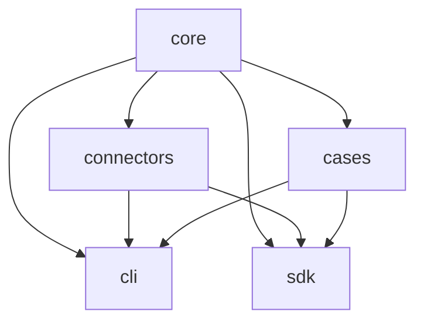

# Package map

These TypeScript packages now form the hosted browser and release-compatibility layer. The canonical user-facing analysis package is [`src/cascadelens`](../src/cascadelens/).

## Responsibilities

| Package | Owns | May depend on |
|---|---|---|
| [`core`](core/src/) | Browser-compatible WorldGraph contracts and deterministic analysis parity | Node.js standard library plus the audited YAML parser |
| [`connectors`](connectors/src/) | Source catalog, bounded acquisition, CSV/ZIP normalization, stable IDs, resumable checkpoints, manifests, and conservative WorldGraph mapping | `core` |
| [`cases`](cases/src/) | Sixteen deterministic case specifications, decision profiles, capability taxonomy, and build orchestration | `core` |
| [`cli`](cli/src/) | Reviewed website case/connector build and release-maintainer commands | `core`, `connectors`, `cases`, release scripts |
| [`sdk`](sdk/src/) | Typed compatibility exports for the hosted TypeScript surface | `core`, `connectors`, `cases` |

## Dependency direction

Arrows mean “is consumed by.” The core must not import UI, connectors, cases, CLI, SDK, network acquisition, or generated content. The web product consumes reviewed outputs and core contracts; it does not implement an independent analytical engine.

## Public entry points

- Python CLI: `cascadelens --help`
- Python API: [`../src/cascadelens`](../src/cascadelens/)
- Browser compatibility: [`sdk/src/index.ts`](sdk/src/index.ts)
- JSON Schemas: [`../schemas`](../schemas/)
- Extension requirements: [`../docs/EXTENDING.md`](../docs/EXTENDING.md)
