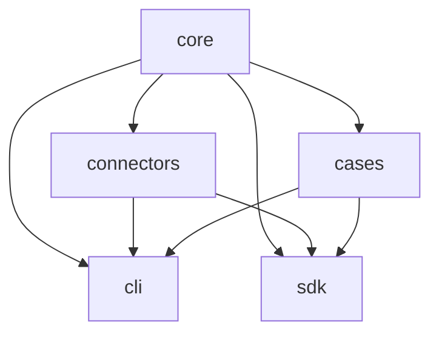

# Package map

CascadeLens keeps the analytical core small and deterministic, then exposes it through bounded adapters and interfaces. The package directories are intentionally stable; this page supplies navigation without adding a workspace abstraction that the current build does not need.

## Responsibilities

| Package | Owns | May depend on |
|---|---|---|
| [`core`](core/src/) | WorldGraph contracts, evidence and time validation, ShockScript, cascade engines, intervention analysis, observability, benchmark scoring, canonicalization, and RiskPack | Node.js standard library only |
| [`connectors`](connectors/src/) | Source catalog, acquisition contracts, CSV normalization, network guards, and manifests | `core` |
| [`cases`](cases/src/) | Twelve deterministic case specifications and their build orchestration | `core` |
| [`cli`](cli/src/) | Input validation, analysis execution, case/connector discovery, RiskPack writing, and verification | `core`, `connectors`, `cases`, release scripts |
| [`sdk`](sdk/src/) | Typed public exports and the offline `analyzeScenario` helper | `core`, `connectors`, `cases` |

## Dependency direction

Arrows mean “is consumed by.” The core must not import UI, connectors, cases, CLI, SDK, network acquisition, or generated content. The web product consumes reviewed outputs and core contracts; it does not implement an independent analytical engine.

## Public entry points

- CLI: `npm run cascadelens -- --help`
- SDK: [`sdk/src/index.ts`](sdk/src/index.ts)
- JSON Schemas: [`../schemas`](../schemas/)
- Extension requirements: [`../docs/EXTENDING.md`](../docs/EXTENDING.md)
